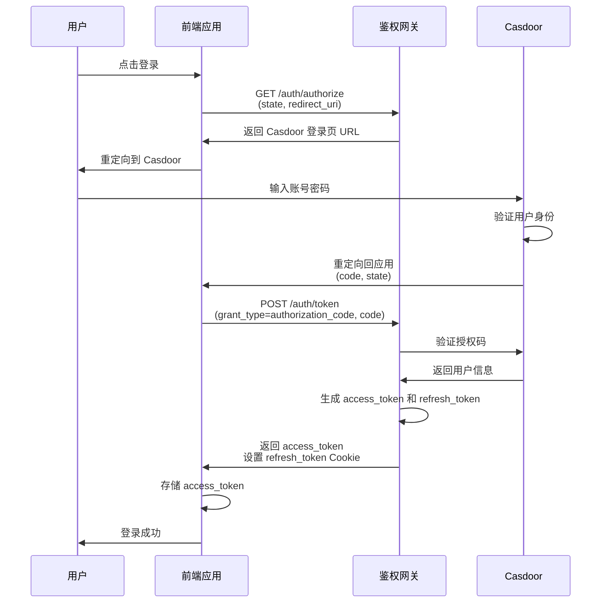
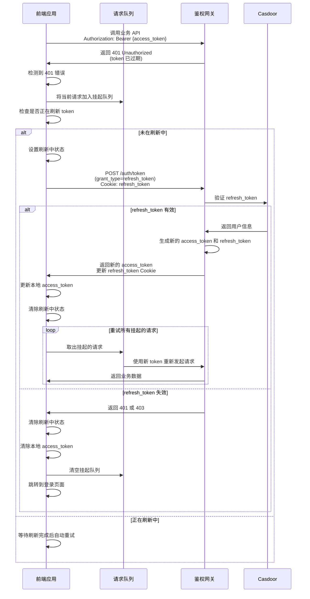
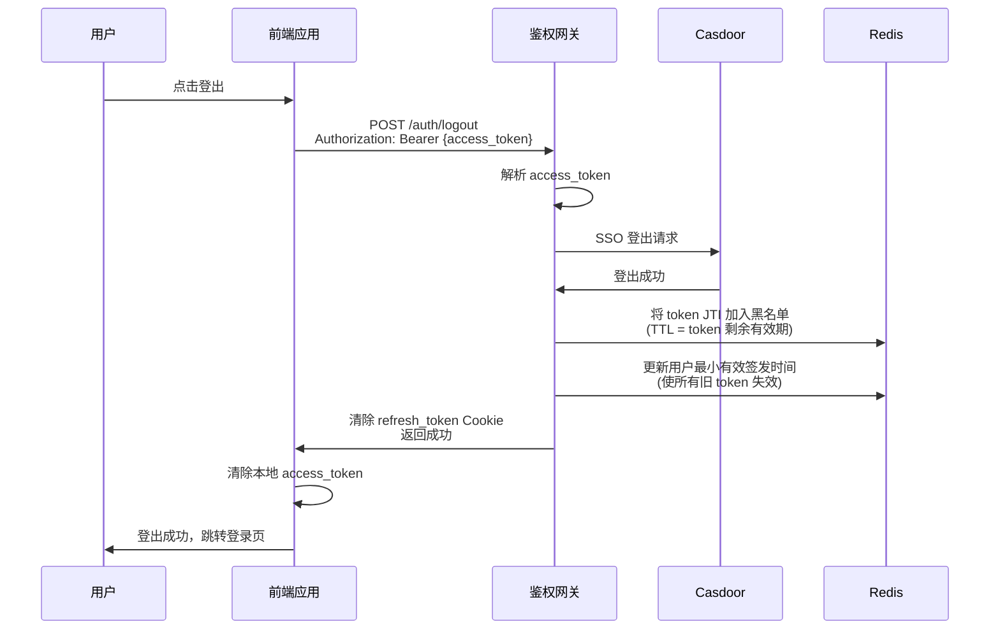

# 后端文档

## 认证鉴权模块

本系统基于 OAuth2 授权码模式实现统一认证，完整的登录流程和前端集成示例请参考 `<后端地址>/demo/index.html` 演示页面。

### 接口列表

| 接口                | 方法 | 说明                                                                           |
| ------------------- | ---- | ------------------------------------------------------------------------------ |
| `/auth/authorize` | GET  | OAuth2 授权端点，重定向用户到 Casdoor 登录页面                                 |
| `/auth/token`     | POST | 使用授权码换取访问令牌，或通过刷新令牌更新访问令牌（刷新令牌通过 Cookie 传递） |
| `/auth/logout`    | POST | 用户登出，注销访问令牌并清除刷新令牌                                           |

### OAuth2 授权码登录流程



### Token 刷新流程



### 用户登出流程



### 前端集成要点

#### 1. 请求拦截器实现

前端需要实现 HTTP 请求拦截器来处理 token 过期的情况：

```javascript
// 示例代码（基于 axios）
let isRefreshing = false; // 是否正在刷新 token
let pendingRequests = []; // 挂起的请求队列

// 响应拦截器
axios.interceptors.response.use(
  (response) => response,
  async (error) => {
    const originalRequest = error.config;

    // 检测到 401 错误且不是刷新 token 的请求
    if (error.response?.status === 401 && !originalRequest._retry) {
      if (isRefreshing) {
        // 正在刷新中，将请求加入队列
        return new Promise((resolve) => {
          pendingRequests.push(() => {
            resolve(axios(originalRequest));
          });
        });
      }

      originalRequest._retry = true;
      isRefreshing = true;

      try {
        // 调用刷新 token 接口
        const response = await axios.post('/auth/token', {
          grant_type: 'refresh_token'
        });

        const { access_token } = response.data;
      
        // 更新本地存储的 token
        localStorage.setItem('access_token', access_token);
      
        // 更新默认请求头
        axios.defaults.headers.common['Authorization'] = `Bearer ${access_token}`;
      
        // 重试所有挂起的请求
        pendingRequests.forEach(callback => callback());
        pendingRequests = [];
      
        // 重试当前请求
        originalRequest.headers['Authorization'] = `Bearer ${access_token}`;
        return axios(originalRequest);
      
      } catch (refreshError) {
        // refresh_token 也失效了，清除所有状态并跳转登录页
        pendingRequests = [];
        localStorage.removeItem('access_token');
        window.location.href = '/login';
        return Promise.reject(refreshError);
      
      } finally {
        isRefreshing = false;
      }
    }

    return Promise.reject(error);
  }
);
```

#### 2. 关键注意事项

- **全局单例状态**: `isRefreshing` 标志必须是全局单例，确保同时只有一个刷新请求
- **请求队列管理**: 所有因 token 过期失败的请求都应加入队列，等待刷新完成后批量重试
- **避免循环刷新**: 使用 `_retry` 标记防止同一个请求无限重试
- **Cookie 自动携带**: `refresh_token` 存储在 HttpOnly Cookie 中，浏览器会自动携带，无需手动处理
- **失败降级处理**: 当 `refresh_token` 失效时，应清空队列、清除本地数据并跳转登录页
- **并发请求优化**: 多个请求同时遇到 401 时，只发起一次刷新，其他请求等待刷新结果

#### 3. 访问受保护接口

所有需要认证的接口，前端需在请求头中携带访问令牌：

```javascript
// 设置默认请求头
axios.defaults.headers.common['Authorization'] = `Bearer ${access_token}`;

// 或在每次请求时携带
axios.get('/api/user', {
  headers: {
    'Authorization': `Bearer ${access_token}`
  }
});
```

---

## 应用管理模块

管理 OAuth2 客户端应用，每个应用拥有独立的 `client_id` 和 `client_secret`，用于后端应用。

### 接口列表

| 接口                    | 方法  | 说明                                               |
| ----------------------- | ----- | -------------------------------------------------- |
| `/application`        | POST  | 创建应用，需提供应用标识、名称和重定向URI列表      |
| `/application/{name}` | GET   | 获取应用详情，包含 client_id、client_secret 等信息 |
| `/application`        | GET   | 获取应用列表(支持分页)                             |
| `/application/{name}` | PATCH | 更新应用信息                                       |

**⚠️ 说明**:

- 所有接口需携带 `Authorization: Bearer {access_token}` 请求头
- 创建应用时系统自动生成 `client_id` 和 `client_secret`(后端开发应用会用到)

---

## 组织管理模块

组织代表使用系统的企业或团队，每个组织拥有独立的用户体系和数据隔离。

### 接口列表

| 接口                     | 方法  | 说明                             |
| ------------------------ | ----- | -------------------------------- |
| `/organization`        | POST  | 创建组织，自动生成企业管理员账号 |
| `/organization/{name}` | GET   | 获取组织详情                     |
| `/organization`        | GET   | 获取组织列表(支持分页)           |
| `/organization/{name}` | PATCH | 更新组织信息                     |

**⚠️ 说明**:

- 创建组织时，系统会在 Casdoor 中创建对应组织
- 自动生成默认管理员用户 (用户名: `<组织的name>-admin`，密码 `Admin@246`)

---

## 用户管理模块

管理组织下的用户，支持创建、查询、更新和密码管理功能。

### 接口列表

| 接口                              | 方法  | 说明                                               |
| --------------------------------- | ----- | -------------------------------------------------- |
| `/user`                         | POST  | 创建用户，需指定用户名、昵称、所属组织和密码       |
| `/user/{owner}/{name}`          | GET   | 获取用户详情                                       |
| `/user`                         | GET   | 获取用户列表(支持分页)                             |
| `/user/{owner}/{name}`          | PATCH | 更新用户信息                                       |
| `/user/{owner}/{name}/password` | POST  | 修改密码，用户需提供旧密码，管理员重置密码时可省略 |

**⚠️ 说明**:

- 系统管理员可查看所有组织的用户
- 企业管理员只能管理自己组织下的用户
- 密码长度要求 6-100 位，建议使用强密码(前端不用进行md5等混淆处理)

---

## 订阅管理模块

管理组织对应用的订阅关系，用于控制组织对特定应用的访问权限和有效期。

### 接口列表

| 接口                             | 方法  | 说明                               |
| -------------------------------- | ----- | ---------------------------------- |
| `/subscription`                | POST  | 创建订阅，为组织订阅指定应用       |
| `/subscription/{owner}/{plan}` | GET   | 获取订阅详情                       |
| `/subscription`                | GET   | 获取订阅列表(支持分页和多条件筛选) |
| `/subscription/{owner}/{plan}` | PATCH | 更新订阅信息，可修改有效期和状态   |

**⚠️ 说明**:

- `owner` 为组织唯一标识符，`plan` 为应用唯一标识符
- 订阅状态包括: `Active`(激活)、`Suspended`(停用)
- 系统管理员可手动修改企业订阅状态实现订阅期内禁用功能
- 创建订阅时需指定开始时间和结束时间，结束时间必须晚于开始时间

---

## 典型使用流程

### 1. 系统初始化

```plaintext
① 系统管理员创建组织 (POST /organization)
   → 系统自动生成企业管理员账号

② 系统管理员创建应用 (POST /application)
   → 获得 client_id 和 client_secret
```

### 2. 用户管理

```plaintext
① 企业管理员添加用户 (POST /user)
   → 指定用户名、昵称、组织和初始密码

② 用户首次登录后修改密码 (POST /user/{name}/password)
```

### 3. 前端应用集成

```plaintext
① 用户点击登录 → 重定向到 /auth/authorize
② 在 Casdoor 完成登录
③ 获取授权码 → 调用 /auth/token 换取令牌
④ 使用访问令牌调用受保护接口

详细实现请参考: /demo/index.html
```
